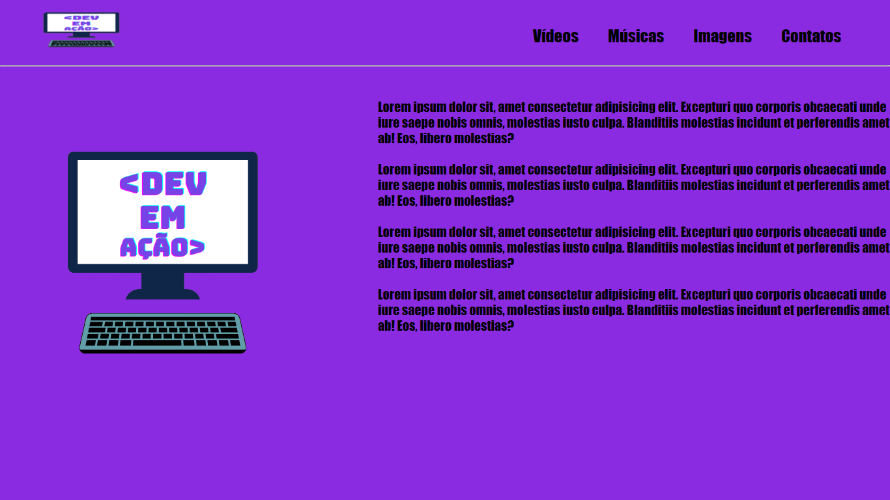

# HomePage_With_HTML-CSS
<h3>Neste projeto será implementada uma home page, feita em HTML e estilizada em CSS.<h3>

<h1>🖥 Sobre o projeto<h1>
<h3>O projeto tem a finalidade de criar uma home page simples, ensinando uma maneira diferente de se fazer a estrutura de uma home page e sua estilização.<h3>

<h1>✅ HomePage pronta!<h1>

<h1>🛠 Ferramentas Utilizadas<h1>
